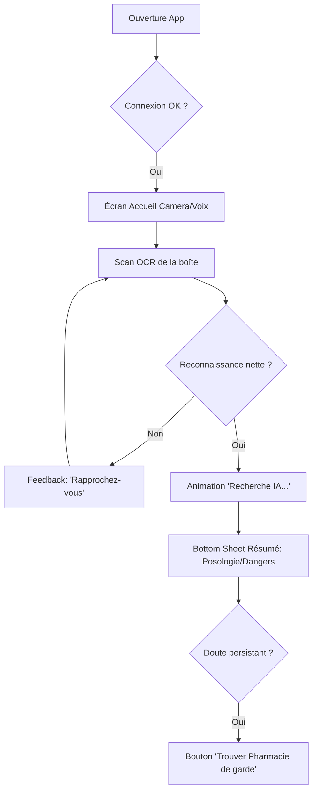
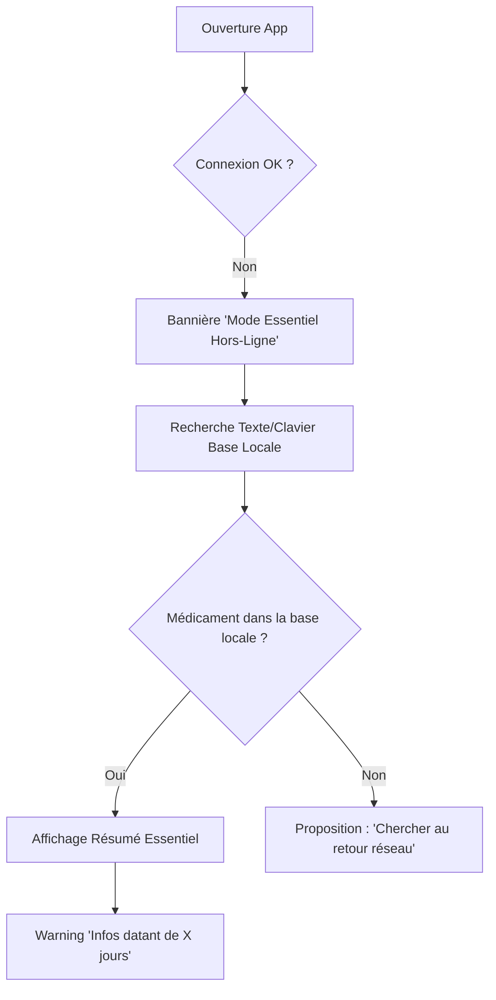
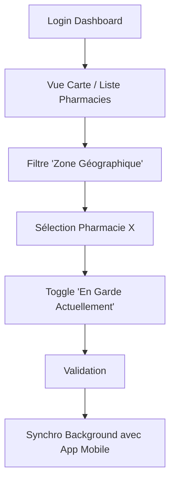

---
stepsCompleted:
  - step-01-init
  - step-02-discovery
  - step-03-core-experience
  - step-04-emotional-response
  - step-05-inspiration
  - step-06-design-system
  - step-07-defining-experience
  - step-08-visual-foundation
  - step-09-design-directions
  - step-10-user-journeys
  - step-11-component-strategy
  - step-12-ux-patterns
  - step-13-responsive-accessibility
  - step-14-complete
inputDocuments:
  - prd.md
  - architecture.md
  - Pharma_AI_Product_Brief.md
workflowType: 'create-ux-design'
project_name: 'Tiba'
user_name: 'jesse'
date: '2026-03-18'
---

# UX Design Specification Tiba

**Author:** jesse
**Date:** 2026-03-18

---

<!-- UX design content will be appended sequentially through collaborative workflow steps -->

## Executive Summary

### Project Vision

Tiba est un assistant de santé digital grand public (Focus B2C). Son objectif est de démocratiser l'accès à l'information médicale fiable en Afrique francophone en rendant les notices de médicaments interactives via l'I.A. (RAG) et en connectant les familles aux pharmacies de garde, avec une résilience totale "Offline-First".

### Target Users

**1. L'Utilisateur Final (Ex: Maman Aminata) :** 35-45 ans, gère la santé de la famille. Elle n'a pas le temps de naviguer dans des menus complexes. Elle veut une réponse immédiate, rassurante et fiable à une situation de stress (ex: "Mon fils a de la fièvre, comment doser ce Doliprane ?").
**2. L'Opérateur Tiba (Backoffice) :** Gère la saisie massive de données et la mise à jour des stocks des pharmacies partenaires de manière asynchrone pour garder la base à jour.

### Key Design Challenges

- **Friction Zéro sur l'Input :** Le scan OCR de la boîte de médicament et la saisie vocale doivent être les éléments centraux de l'écran d'accueil, accessibles en un seul tap, sans clavier.
- **Confiance & Autorité Visuelle (Safety First) :** L'interface de chat avec l'IA ne doit pas ressembler à "ChatGPT" (qui peut haluciner), mais à un retour médical formel, sourcé, et qui incite toujours à consulter un médecin.
- **Dégradation Gracieuse Hors-Ligne :** Créer une interface qui rassure l'utilisateur quand il perd sa connexion 3G, en basculant fluidement vers l'annuaire local hors-ligne (Drift DB).

### Design Opportunities

- **Interface "Voice-First" :** S'inspirer des usages locaux (très forte utilisation des vocaux WhatsApp) pour interagir avec l'IA de Tiba.
- **Scan "Magique" :** Une expérience de réalité augmentée très fluide lors du scan de la boîte de médicament pour rassurer l'utilisateur sur la reconnaissance du bon produit.
- **Clarté Absolue :** Un design aéré, avec des typographies très lisibles, contrastant avec les applications médicales traditionnelles souvent surchargées d'informations.

## Core User Experience

### Defining Experience
L'action vitale et centrale de Tiba est l'interaction de "Recherche Médicale Augmentée". L'utilisateur doit pouvoir, en situation d'urgence ou de doute, scanner une notice ou poser une question vocale ("Comment prendre ce sirop ?") et obtenir une réponse immédiate, synthétique et 100% fiable tirée des bases de données de santé officielles.

### Platform Strategy
- **Le B2C (Patients) :** Application Mobile Native (Flutter) optimisée pour Android (système ultra-dominant en Afrique). Interface orientée "Touch", Caméra et Microphone. La contrainte matérielle exige une app légère (< 30Mo) et très réactive même sur les téléphones bas de gamme.
- **Le B2B (Opérateurs Tiba) :** Application Web (Next.js) sur Desktop/Tablette. Orientée clavier/souris pour de la saisie intensive de données médicales et la gestion rapide des statuts des pharmacies partenaires.

### Effortless Interactions
- **Le Bouton Scan/Voix :** Doit être énorme, placé au centre de l'écran d'accueil. Aucune navigation complexe ne doit séparer l'ouverture de l'application du premier scan.
- **Le Mode Vocal WhatsApp-like :** Utiliser le paradigme "Maintenir pour parler" que 100% du public cible maîtrise déjà via WhatsApp.
- **Lecture Accessible :** Option de "Text-to-Speech" (lecture audio de la réponse de l'IA) intégrée d'office pour palier aux problèmes d'alphabétisation ou de fatigue visuelle.

### Critical Success Moments
- **Le "Moment Magique" du Premier Scan :** Si la reconnaissance de la boîte de médicament (OCR) est rapide et que l'IA répond correctement en moins de 3.5 secondes, la confiance est gagnée à vie.
- **Le Sauvetage Hors-Ligne :** Quand l'utilisateur perd sa connexion 3G (très fréquent), une bannière élégante "Mode Essentiel Hors-Ligne" apparaît de manière fluide. Il peut toujours trouver la pharmacie de garde la plus proche grâce à la base de données locale (Drift), sans message d'erreur frustrant.

### Experience Principles
1. **La Sécurité avant tout :** L'interface ne doit jamais "supposer". Si l'IA n'a pas la réponse exacte dans sa base certifiée, le design doit élégamment diriger l'utilisateur vers une consultation médicale physique.
2. **Standardisation "WhatsApp" :** Ne pas réinventer la roue des interactions. Utiliser les codes des applications de messagerie que la cible utilise 4 heures par jour.
3. **Patience Architecturée :** Si le traitement IA côté serveur prend 3 secondes, l'interface doit fournir un feedback visuel rassurant ("*Analyse de la notice par l'IA médicale...*") pour éliminer l'anxiété de l'attente.

## Desired Emotional Response

### Primary Emotional Goals
- **Le Soulagement et la Réassurance :** L'émotion principale recherchée est la baisse immédiate de l'anxiété. Lorsqu'un parent cherche une information sur un médicament pour son enfant, l'interface doit respirer le calme, le professionnalisme et la certitude.
- **L'Empowerment (Prise de Pouvoir) :** L'utilisateur doit se sentir intelligent et capable de prendre des décisions éclairées grâce aux réponses structurées de l'IA de Tiba.

### Emotional Journey Mapping
- **Découverte (Lancement de l'app) :** *Espoir et urgence.* L'interface doit répondre immédiatement sans temps de chargement frustrants.
- **Action Principale (Scan ou Voix) :** *Émerveillement.* Le scan OCR ou la reconnaissance vocale doivent paraître "magique" par leur vitesse et leur fluidité.
- **Consommation de l'information (Réponse de l'IA) :** *Confiance et Clarté.* L'utilisateur obtient la réponse. L'agencement du texte (bullet points lisibles) fait baisser sa pression artérielle.
- **Si l'IA ne sait pas (Edge Case) :** *Soutien et Encadrement.* Plutôt que la frustration d'une erreur technique, l'utilisateur ressent qu'il est redirigé en toute sécurité vers l'action de "Consulter un médecin ou aller en Pharmacie".

### Micro-Emotions
- **Confiance vs Scepticisme :** La confiance est gagnée par le "Sourcing" (montrer d'où l'IA tire l'info : "Source: Notice officielle du Doliprane").
- **Calme vs Anxiété :** Le calme est apporté par l'absence d'éléments clignotants ou de couleurs agressives.
- **Connexion vs Isolement :** Le langage naturel (voix) donne le sentiment de parler à un professionnel (le "Pharmacien Digital").

### Design Implications
- **Couleurs et Visuels :** Utiliser des couleurs cliniques mais chaleureuses (ex: Bleu "Santé", Vert profond) et éviter le Rouge sauf pour des alertes médicales graves (ex: "Contre-indication majeure").
- **Animations "Don't Panic" :** Éviter les "spinners" de chargement anxieux. Préférer des "Skeleton screens" (squelettes de chargement) ou des animations de frappe douces (Typing effect) pour montrer que l'IA réfléchit sereinement.
- **Typographie :** Polices extrêmement lisibles, sans empattement (ex: Inter ou Roboto), avec un interligne généreux pour les yeux fatigués.

### Emotional Design Principles
1. **L'empathie structurée :** L'IA est polie, directe et empathique, sans jamais être familière.
2. **Le filet de sécurité visuel :** À tout moment, l'utilisateur doit voir un bouton clair et omniprésent pour "Trouver la pharmacie de garde la plus proche", lui assurant qu'une solution de secours physique existe.

## UX Pattern Analysis & Inspiration

### Inspiring Products Analysis
1. **WhatsApp (La référence d'usage en Afrique) :** C'est l'application reine. Son succès repose sur une interface épurée, un code couleur constant (vert/blanc) et surtout, une mécanique vocale (Voice Notes) devenue une seconde nature pour des millions de personnes.
2. **Yuka (La référence du Scan) :** Excellente dans la satisfaction immédiate. L'utilisateur scanne un code-barres et obtient en une fraction de seconde une fiche produit ultra-lisible (code couleur vert/orange/rouge, évaluation sur 100) sans aucun jargon inutile.
3. **Apple Health / Google Fit (La référence Clinique) :** Ces applications utilisent beaucoup d'espaces blancs (whitespace), des angles très arrondis et une hiérarchie typographique forte pour rendre la donnée de santé "douce" et non anxiogène.

### Transferable UX Patterns
- **L'Input Vocal de WhatsApp :** Le composant "Maintenir pour parler" (Hold-to-Talk) pour poser une question médicale à l'IA, avec une animation d'onde sonore pour confirmer l'écoute.
- **La Fiche Résumé de Yuka :** Après le scan OCR d'une notice, afficher une fiche de résultats "Bottom Sheet" (tiroir qui monte du bas) qui liste les points vitaux : Posologie, Âge minimum, Risques en un coup d'œil.
- **La Hiérarchie d'Apple Health :** Des polices très grandes pour les informations cruciales, et des bordures douces/arrondies pour les cartes d'information.

### Anti-Patterns to Avoid
- **Le "Dashboard of Doom" :** Afficher des dizaines de statistiques ou de boutons sur l'écran d'accueil. Tiba doit avoir un écran d'accueil mono-tâche (Le centre de la caméra ou un gros bouton microphone).
- **Le Mur d'Onboarding :** Obliger l'utilisateur à créer un compte complexe et remplir des formulaires avant de pouvoir faire son premier scan. Tiba doit permettre une utilisation immédiate et proposer la création de compte plus tard (Lazy Registration).
- **Le Jargon Médical Brut :** Afficher le texte de la notice telle quelle sans le résumer ou le simplifier ("L'IA doit agir comme un traducteur, pas une photocopieuse").

### Design Inspiration Strategy
- **On Adopte :** La gratification instantanée du scan (Yuka) et le bouton vocal central (WhatsApp).
- **On Adapte :** L'UI clinique d'Apple Health, mais en la réchauffant avec des choix de couleurs plus locaux et rassurants (ex: teintes d'aube ou de nature).
- **On Évite absolument :** Les menus hamburger profonds, les textes minuscules et l'obligation de créer un compte dès la seconde 1.

## Design System Foundation

### 1.1 Design System Choice
**Approche Hybride "Thématisée" :**
- **Pour l'Application Mobile (Flutter / B2C) :** *Material Design 3 (Thème Hautement Personnalisé)*. Nous utiliserons le moteur Material 3 natif de Flutter, mais en écrasant massivement ses variables visuelles (Design Tokens) pour ne Surtout Pas ressembler à une "application Google générique".
- **Pour le Dashboard Admin (Next.js / B2B) :** *shadcn/ui (avec TailwindCSS)*. Une bibliothèque de composants extrêmement propre, accessible par défaut, et qui donne un rendu très professionnel et clinique immédiatement.

### Rationale for Selection
- **Vitesse vs Unicité :** Créer des boutons graphiques de zéro prend un temps fou. En utilisant Material 3 et shadcn/ui, on hérite de 10 ans de recherche en accessibilité (gestion des clics, lecteurs d'écrans, contrastes). On gagne des mois de développement.
- **Le besoin côté Patient (B2C) :** Maman Aminata s'en fiche que le bouton soit fait "spécialement" pour Tiba. Elle a besoin que le bouton soit reconnaissable et prévisible. Un thème Material 3 personnalisé avec des angles très arrondis et nos propres couleurs offre ce confort.
- **Le besoin côté Opérateur (B2B) :** Les Dashboard métiers doivent être denses en données mais lisibles. `shadcn/ui` excelle pour générer des tableaux et formulaires complexes hyper qualitatifs (ex: pour scanner 500 notices à la chaîne).

### Implementation Approach
1. **Mise en place des "Design Tokens" centraux :** Nous allons isoler 3 couleurs principales, 2 polices de caractères (ex: Inter pour la lecture, Outfit pour les titres), et une règle d'arrondi des bords (Border Radius).
2. **Synchronisation :** Ces Tokens seront codés "en dur" dans le fichier `theme.dart` de Flutter et dans le fichier `tailwind.config.js` de Next.js pour garantir que la marque Tiba est identique partout.

### Customization Strategy
- **Composants Standards :** Les boutons normaux, champs de texte, et menus déroulants utiliseront le comportement par défaut (personnalisé via notre thème).
- **Composants "Hero" (Sur mesure) :** Nous coderons de zéro les éléments au centre de l'expérience (ex: le scanner de notices, l'interface de commande vocale WhatsApp-like, et la bulle de chat de l'IA) car aucun Design System standard ne couvre ces besoins d'interaction "magique".

## Defining Experience Mechanics (Deep Dive)

### L'Action Signature : Le "Scan & Know"
Le super-pouvoir de l'application est de transformer instantanément un bout de papier illisible (la notice médicale physique) en un tableau d'information clair, vocal et rassurant. L'interaction centrale consiste à pointer la caméra sur la boîte ou la notice et obtenir une réponse certifiée.

### User Mental Model
- **La Douleur Actuelle :** Pour lire une notice, il faut déplier un papier immense écrit en police minuscule, rempli de jargon ("Posologie", "Excipients à effet notoire"). C'est anxiogène et difficile d'accès.
- **L'Attente de l'Utilisateur :** Le geste doit être aussi naturel que scanner un QR code ou envoyer une note vocale sur WhatsApp. L'utilisateur s'attend à ce que l'application fasse le tri et la synthèse à sa place, sans effort cognitif de sa part.

### Success Criteria
L'expérience centrale est valide UNIQUEMENT si :
1. **Time-to-Value :** Moins de 5 secondes entre l'ouverture de l'application et l'affichage du résumé du médicament.
2. **"Zero-Click Capture" :** L'appareil photo (OCR) détecte et capture automatiquement la boîte quand elle est cadrée, sans avoir à chercher le bouton.
3. **Hiérarchie Vitale :** Le résultat affiche immédiatement et en évidence la *Posologie*, les *Contre-indications* et l'*Âge limite*.

### Novel UX Patterns
Nous ne réinventons pas un paradigme de zéro, mais nous combinons deux modèles familiers dans un domaine critique :
- Le scan instantané type "Yuka" ou "Google Lens".
- La réponse générative (type ChatGPT), mais "bridée" dans une interface extrêmement structurée (non conversationnelle libre) pour imposer l'autorité et le sérieux médical (RAG Strict).

### Experience Mechanics
**La Boucle "Scan & Know" pas-à-pas :**
1. **Initiation :** À l'ouverture de l'app, l'écran principal est dominé par l'objectif de la caméra (ou un très gros bouton central). L'utilisateur pointe son téléphone.
2. **Interaction :** Une zone de focus animée (Type "Scanner AR") guide l'utilisateur pour cadrer le nom du médicament. L'application gère l'autofocus et la capture s'il est net. Un bouton microphone (Hold-to-talk) reste accessible en permanence.
3. **Feedback :** Une petite vibration haptique confirme la capture. L'écran affiche un "Skeleton Loading" (squelette gris) avec une phrase rassurante : *"Recherche dans la base de données médicale officielle..."*
4. **Completion :** Un "Bottom Sheet" glisse vers le haut avec le nom du médicament reconnu, validé par une icône bouclier vert, et 3 puces claires : À quoi ça sert / Comment le prendre / Dangers. Un bouton "Écouter" (Text-to-speech) s'anime doucement.

## Visual Design Foundation

### Color System
L'objectif est d'éviter le "Blanc Hôpital" stérile et anxiogène, tout en gardant une autorité clinique.
- **Primary (Brand & Action) : Vert Santé (#0B8E71).** Un vert profond qui inspire la croissance, la validation (Check) et rappelle la croix des pharmacies.
- **Background (Surface B2C) : Sable Chaud (#F5F0E6).** Un fond légèrement teinté, beaucoup plus doux pour les yeux que le blanc pur, donnant un aspect "organique" et local.
- **Alert (Danger) : Rouge Corail (#E85D75).** Utilisé pour les contre-indications majeures. Moins agressif qu'un rouge pur, mais suffisamment contrasté pour alerter.
- **Text (Lecture) : Charbon Profond (#1A1A1A).** Plus lisible et moins fatigant que le noir absolu (#000000).

### Typography System
La hiérarchie doit séparer la donnée médicale complexe du reste de l'interface.
- **Titres & Chiffres Clés (Hero) : *Outfit*.** Une police sans-serif géométrique, moderne et chaleureuse. Parfaite pour afficher un "3 Gouttes" géant.
- **Corps de texte & Notices : *Inter*.** La reine de la lisibilité sur écran. Optimisée pour être lue même sur les très petits écrans des smartphones d'entrée de gamme.

### Spacing & Layout Foundation
- **Espace Vital (Whitespace) :** Nous utilisons un système de grille de 8px avec des marges *massives* (ex: 24px ou 32px entre chaque bloc de données). Le vide visuel aide à combattre la surcharge cognitive face au jargon médical.
- **La Règle du "Soft Edge" :** Aucun angle droit dans l'application B2C. Toutes les cartes, boutons et images ont un "Border Radius" généreux (16px à 24px). Les formes rondes (pill-shaped) sont perçues psychologiquement comme inoffensives et sûres.

### Accessibility Considerations
- **Fatigue Visuelle & Contraste :** Respect strict de la norme WCAG AA (Ratio 4.5:1 minimum) pour être lisible en plein soleil dans la rue (quand on cherche une pharmacie de garde).
- **"Fat Finger" Targets :** Toutes les zones interactives (bouton vocal, scan) ont une taille minimale absolue de 48x48px pour éviter les erreurs de clic en situation de stress.

## Design Direction Decision

### Design Directions Explored
Nous avons exploré 6 approches visuelles distinctes pour l'interface patient (B2C) :
1. "Organic Warmth" (Chaleureux, rassurant, vert santé et fond sable).
2. "Clinical Clean" (Blanc clinique, bleu électrique, de type Apple Health).
3. "Native Familiarity" (Esthétique WhatsApp hyper-familière).
4. "High Contrast / Dark" (Mode sombre par défaut pour lecture de nuit).
5. "Authority & Trust" (Bleu marine, institutionnel).
6. "Playful Gamified" (Ludique, dédramatisé, formes 3D).

### Chosen Direction
**Direction 1 : "Organic Warmth"** a été validée.

### Design Rationale
Cette direction offre le parfait équilibre entre le sérieux médical indispensable (le Vert Santé #0B8E71 comme validateur certifié) et la douceur nécessaire en situation de stress (le fond Sable #F5F0E6 qui repose les yeux, les formes rebondies "pill-shaped"). Elle évite le côté anxiogène d'un hôpital stérile (blanc pur) tout en évitant le côté gadget d'une application ludique. C'est un design thérapeutique adapté au public cible africain.

### Implementation Approach
- **Tokens Flutter :** Implémentation via `Material 3` avec génération d'un `ColorScheme` personnalisé basé sur les couleurs "Organic Warmth".
- **Composants :** Tous les `Card`, `FloatingActionButton`, et `Dialog` auront un `borderRadius` forcé à 24px (Soft Edges).
- **Micro-animations :** Les retours haptiques et animations d'expansion (Bottom Sheets) devront paraître fluides et souples (courbes de bézier personnalisées).

## User Journey Flows

### 1. Journey : Le "Scan & Know" (Urgence B2C)
Ce parcours est celui de Maman Aminata. Le but est d'obtenir une posologie claire en moins de 5 secondes avec le moins d'interactions possibles sur l'écran.

### 2. Journey : Le Mode Dégradé Hors-Ligne (Résilience)
Parcours destiné aux zones blanches ou aux professionnels (Dr. Diallo) qui n'ont plus de réseau cellulaire.

### 3. Journey : Mise à jour des Gardes (Opérateur B2B)
Parcours pour l'opérateur Tiba sur son ordinateur (Next.js) qui doit rapidement mettre à jour le statut des pharmacies.

### Journey Patterns
- **Le Fallback "Pharmacie" :** Chaque résultat de médicament (Online ou Offline) possède un CTA (Call-to-Action) universel à la fin : "Trouver ce produit / Contacter une pharmacie".
- **Le Skeleton Loading Rassurant :** À chaque appel réseau (RAG IA), on affiche l'architecture de la réponse vide animée en gris, plutôt qu'une roue qui tourne à l'infini.

### Flow Optimization Principles
- **0 Clics avant action :** L'appareil photo est le fond de l'écran d'accueil. On évite le parcours "Ouvrir l'app -> Menu -> Scanner un produit -> Autoriser caméra".
- **Dégradation Gracieuse de l'Input :** Si le Scan OCR échoue 2 fois de suite, l'application propose automatiquement massivement le "Mode Vocal" au lieu de faire planter le flux.

## Component Strategy

### Design System Components (Fondations)
- **App Patient (Flutter / B2C) :** Utilisation native des composants Material 3 (`Card`, `BottomSheet`, `TextField`) mais **surchargés** avec nos Design Tokens (Border-radius à 24px, fond Sable, Vert Santé).
- **Dashboard Opérateur (Next.js / B2B) :** Utilisation stricte de *shadcn/ui* (`DataTable`, `Form`, `Toggle`) pour un développement rapide et extrêmement robuste.

### Custom Components (À développer sur mesure)

**1. The "Hero Scan" Viewfinder (Composant AR Caméra)**
- **Purpose:** Guider l'utilisateur pour cadrer la boîte de médicament. 
- **States:** `Searching` (Coins blancs clignotants), `Focused` (Coins verts avec retour haptique), `Processing` (Squelette de chargement gris).
- **Rationale:** Aucun design system standard n'a de composant de réalité augmentée prêt à l'emploi. C'est le cœur de notre application.

**2. The "Voice Assistant" Orb (Le Bouton Vocal WhatsApp-like)**
- **Purpose:** Permettre la question vocale ("Comment donner ce sirop ?") en un geste.
- **Interaction:** "Hold-to-Talk" (Maintenir pour parler).
- **States:** `Idle` (Gros bouton rond), `Recording` (Onde sonore dynamique rouge/verte selon la voix), `Transcribing` (Animation de chargement douce).

**3. The "Medical Result Pill" (Fiche Résumé Sécurisée)**
- **Purpose:** Afficher le résultat de l'IA de manière non-anxiogène.
- **Anatomy:** 
  - Header: Nom du produit + "Bouclier Vert" de vérification.
  - Body: 3 sections fixes (Posologie, Dangers, Âge).
  - Footer: Bouton "Play" (Texte-to-speech) et "Aller en Pharmacie".
- **Rationale:** Une simple "Card" Material n'est pas assez structurée pour la donnée médicale. Ce composant doit inspirer une confiance absolue.

### Component Implementation Strategy
- **Isolation :** Tous les composants personnalisés (ex: `HeroScanViewfinder.dart`) seront placés dans un dossier `presentation/widgets/custom` et ne dépendront que du thème central.
- **Accessibilité forcée :** Le composant `Voice Assistant Orb` sera toujours au moins à 64x64px (très gros "Fat Finger target"). Le `Result Pill` lira son contenu via lecteur d'écran (Screen Reader) nativement.

### Implementation Roadmap
**Phase 1 (Le Cœur MVP) :** Développer le `Hero Scan Viewfinder` et le `Result Pill` (indispensables pour lire une notice).
**Phase 2 (L'Accessibilité B2C) :** Ajouter le `Voice Assistant Orb` pour les requêtes vocales (très important pour le public cible).
**Phase 3 (Le B2B) :** Déployer les DataTable shadcn pour que les opérateurs mettent à jour les pharmacies.

## UX Consistency Patterns

### Button Hierarchy
La règle de l'action unique : l'utilisateur de l'application mobile (B2C) ne doit jamais avoir plus d'un bouton principal par écran.
- **Primary Actions (Hero) :** Toujours de couleur "Vert Santé" (#0B8E71), complètement opaques, massifs (min. hauteur 56px), avec un texte en majuscules ou une icône grasse.
- **Secondary Actions :** Boutons contour (Outlined) ou Boutons Fantômes (Ghost - juste du texte clickable de couleur sombre). Utilisés pour les actions comme "Annuler" ou "Histoire".
- **Destructive Actions :** Text rouge corail (#E85D75), avec toujours une confirmation de type "BottomSheet" pour prévenir les erreurs.

### Feedback Patterns
Dans un contexte de santé infantile, le feedback doit être immédiat et rassurant.
- **Success :** Retour "Haptic" (vibration douce du téléphone) systématique lors d'un scan réussi + apparition du "Bouclier Vert".
- **Loading (Patience Architecturée) :** Bannissement total des "Spinnners" (Roue qui tourne) qui génèrent de l'anxiété. Remplacement systématique par un **Skeleton Loader** (un bloc gris clair qui s'anime comme une vague) indiquant la structure de la réponse IA imminente.
- **Error (Non bloquante) :** Jamais de "Pop-up" agressive au milieu de l'écran qui bloque l'action ("Erreur 404"). Utilisation de **Toasts** (petites notifications éphémères en bas de l'écran) qui disparaissent seules après 3 sec (Ex: *"Impossible de lire la boîte, rapprochez-vous"*).

### Modal & Overlay Patterns
- **Le paradigme du "Tiroir interactif" (Bottom Sheets) :** 90% des réponses médicales ou formulaires complexes n'ouvrent pas une nouvelle page complète. Ils glissent depuis le bas de l'écran (Bottom Sheet).
- **Pourquoi ?** Cela permet de garder le contexte visuel (l'utilisateur voit toujours l'appareil photo ou la carte en arrière-plan) et de fermer la fenêtre en faisant simplement glisser son doigt vers le bas (Swipe-to-dismiss), un geste devenu naturel.

### Navigation Patterns
- **Bottom Navigation Bar :** La navigation se fait par le bas, à portée de pouce (Reachability). Uniquement 3 onglets (L'essentiel) :
  1. Scanner / Voix (L'accueil par défaut)
  2. Historique (Pour retrouver une posologie consultée hier)
  3. Secours / Pharmacies (L'annuaire d'urgence)
- **Pas de Menu Hamburger :** Les utilisateurs non-experts "oublient" ce qui est caché derrière les 3 petites lignes en haut à gauche. L'information critique doit être visible.

## Responsive Design & Accessibility

### Responsive Strategy
Tiba a deux plateformes distinctes, donc deux stratégies :
- **App B2C (Flutter) :** *Mobile-Strict (Portrait Only)*. Pour l'expérience patient, nous bloquons l'application en mode Portrait. Devoir tourner son téléphone pour scanner une notice ou lire un résultat crée de la friction. L'interface s'étire fluidement pour couvrir les très petits écrans (ex: Itel, Tecno) jusqu'aux grands smartphones (iPhone Max).
- **Dashboard B2B (Next.js) :** *Desktop-First*. Les opérateurs saisissent de la donnée sur ordinateur ou tablette. L'interface utilise toute la largeur de l'écran pour afficher des tableaux de données (DataTables) complexes.

### Breakpoint Strategy
- **Mobile (B2C) :** Le design doit être parfait dès **320px** de large (les très vieux smartphones encore en circulation).
- **Desktop (B2B) :** Breakpoints classiques Tailwind (`md: 768px` pour tablette, `lg: 1024px` pour les ordinateurs portables, `xl: 1280px` pour les grands écrans).

### Accessibility Strategy
Nous visons le standard **WCAG 2.1 niveau AA** avec des adaptations spécifiques au marché cible :
- **Text-To-Speech (Lecture Audio) natif :** L'illettrisme ou la fatigue visuelle ne doivent pas empêcher la compréhension. Chaque posologie générée par l'IA possède un bouton "Écouter" très visible.
- **Micro-Contrastes :** Aucun texte gris clair sur fond blanc. Le texte médical critique est toujours "Charbon" (#1A1A1A) sur fond clair (Ratio supérieur à 4.5:1).
- **Fat-Finger Targets :** La surface de frappe minimale pour *n'importe quel* bouton est de **48x48px**. Un parent stressé tremblant légèrement doit pouvoir appuyer sur le bon bouton.
- **Réglages Système :** L'application doit obligatoirement respecter l'agrandissement de police (Dynamic Type) réglé par l'utilisateur dans les paramètres de son téléphone Android.

### Testing Strategy
- **QA Matériel :** Tests obligatoires sur des appareils d'entrée de gamme Android (RAM < 2Go, écrans basse résolution) très représentatifs du marché africain.
- **Simulation de Stress Humain :** Vérifier que les boutons d'urgence restent utilisables d'une seule main, avec le pouce, dans la partie inférieure de l'écran (Thumb Zone).

### Implementation Guidelines
- **Flutter (B2C) :** Envelopper chaque composant Custom (ex: Le Result Pill) avec le widget `Semantics` pour que `TalkBack` (Android) puisse lire l'écran aux malvoyants. Ne pas "hardcoder" les tailles de police, mais utiliser `Theme.of(context).textTheme` en mode responsive.
- **Next.js (B2B) :** S'assurer que tous les formulaires `shadcn/ui` peuvent être navigués uniquement au clavier (Touche "Tab") pour accélérer la saisie des opérateurs.
